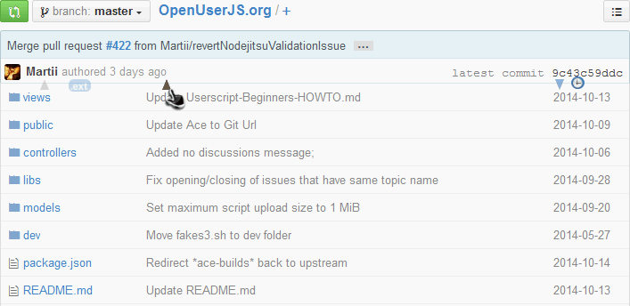

### **GitHub Sortable filelist** **[[`source`]](../src/GitHub_Sortable_filelist.user.js)** **[[`Install`]](/../../raw/master/src/GitHub_Sortable_filelist.user.js  "You must have GreaseMonkey installed")**

#### **Script summary:** appends sorting function to github directories

=====

=====

