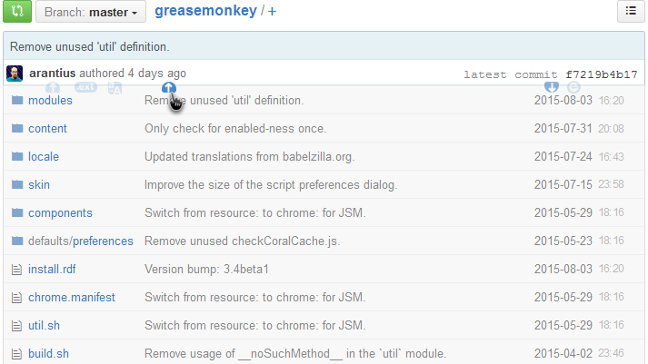

### **GitHub Sortable filelist** **[[`source`]](../src/GitHub_Sortable_Filelist.user.js)** **[[`Install`]](/../../raw/master/src/GitHub_Sortable_Filelist.user.js  "You must have GreaseMonkey installed")**

#### description: *appends sorting function to github directories*

=====

=====

