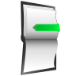
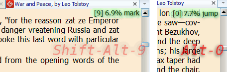

 | **Y-marker** **[[`source`]](../src/Y-marker.user.js)** **[[`Install`]](/../../raw/master/src/Y-marker.user.js  "You must have GreaseMonkey installed")** 
--- |-----  
description | <i>Sets up keyboard shortcuts for placing bookmarks and navigation inside webpage</i>

You can save current position in displayed webpage using shortcuts  **Shift-Alt-0‥9**; &nbsp; later, you may return to saved position by pressing **Alt -0‥9**. &nbsp;  Markers created in this way are kept in browser's persistent memory and they will be restored next time you open the page.

### notes

* Before jumping to marker the script stores the current page position, so you can get back by pressing **Alt-minus** (that on the right of zero.)
* When you open webpage the script tries to restore previously saved position #0
* Positions are calculated in screen's pixels, so if you alter zoom factor, or text column width, or something else, markers may become invalid :( 
* You can change script's keyboard shortcuts using GreaseMonkey menu:
<pre><em>User Script Commands</em> → <b>Y-marker hotkeys</b></pre> 
* press <b><em>Alt-Shift-0</em></b> &nbsp; twice to set starting Y-position for any page in the whole domain
* click on pop-up message at top-right corner to remove all markers for current webpage. &nbsp;   
* you can control the script through bookmarklets:   &nbsp; - *jump to bookmark #0:* <pre><code>javascript:postMessage('Y-marker0','\*')</code></pre> &nbsp; - *set up  bookmark #0:* <pre><code>javascript:postMessage('Y-marker0=','\*')</code></pre> 

******
