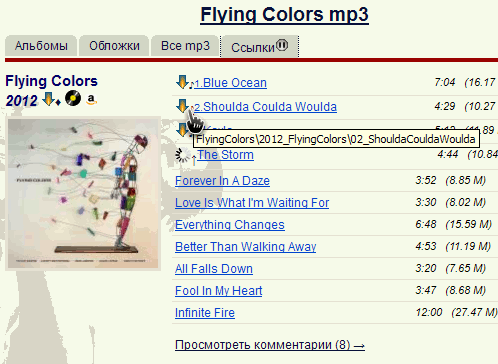

### musicmp3 download booster **[[`JS`]](../src/musicmp3_download_booster.user.js)**     **[[`Install`]](https://github.com//trespassersW/UserScripts/raw/master/src/musicmp3_download_booster.user.js)**

#### **Script summary:**  автоматизация закачки треков с сайта musicmp3spb.org 

скрипт добавляет к странице со списком треков новый пункт меню <Cсылки>, 
по клику на который загружаются прямые ссылки на все перечисленные треки, 
после чего, используя менеджер загрузки, можно скачивать все треки скопом - без утомительной мышиной возни.

====

Есть [инструкция](http://userscripts-mirror.org/topics/87458.html) по настройке 
менеджера загрузки [DownThemAll](http://www.downthemall.net/) для закачки треков с [musicmp3spb.org](http://musicmp3spb.org)

====

* v 1.3 014/03/29 fixes for new firefoxes
* v 1.2.2b ссылки для поиска диска на сайтах [amazon.com](http://www.amazon.com/gp/new-releases/music/408264/ref=zg_bsnr_nav_m_3_292809) и [discogs.com](http://www.discogs.com/search/?sort=date_added%2Cdesc&genre_exact=Rock)

-----
