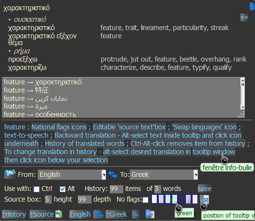

|  | ***translate.google tooltip*** | **[[`source`]](../src/translate.google_tooltip.user.js)** **[[`Install`]](/../../raw/master/src/translate.google_tooltip.user.js)** |
| :----: | :---- | ---------------------- |
##### *Script summary:*  Translates selected text into a ‘tooltip’ via Google translate 

Select word or phrase with <ins><strong><em>Alt</em></strong></ins> key pressed - then hover over an icon below the selection. 
Almost instantly you will see a tooltip with the translation. 

 

***Please look more closely at the picture below:*** 

 

 Also, you can translate selected text using Greasemonkey menu:  &nbsp;  <code><i><b>Tools</b> → <b>Greasemonkey</b> → <b>User Script Commands</b></i>  → <b>translate.google tooltip</b></code> or through <a href=https://en.wikipedia.org/wiki/Bookmarklet>bookmarlets</a> --   &nbsp; any → french:: &nbsp; <code>javascript:postMessage('tgtooltip auto|fr','\*')</code>  &nbsp; 中国 → english:: &nbsp; <code>javascript:postMessage('tgtooltip zh-CN|en','\*')</code> either by the means of <em><a href=https://addons.mozilla.org/firefox/addon/custom-buttons>Custom buttons</a></em> --    &nbsp; русский → español :: <code>content.postMessage('tgtooltip#ru/es','\*')</code> Sample bookmarklets and custombuttons can be found <a href=https://rawgit.com/trespassersW/UserScripts/master/htm/customButt.htm>here</a>

* 16.09.01 `[+]` *previous translation* button; option for left/right tooltip position.
* 16.08.16 [ :tropical_fish: ] ***Word Definition*** is shown when `source_language == target_language`     *bookmarklet:* `javascript:postMessage('tgtooltip en|en','\*')` <em>Custom button:</em> `content.postMessage('tgtooltip en|en','*')`
* 16.01.16.1 `+` alternative translation
* 3.7.2 2015-04-20 `*` TTS: <em>`alt`-select</em> text inside tooltip and <em>`[shift/ctrl]`-click</em> language icon below.    :loudspeaker: [tts tips + 2015-10-31](./translate_tts_tips.md) 

<small>

 <small> Script uses <a href="http://www.senojflags.com">Country flag</a> &nbsp; <a href=https://rawgit.com/trespassersW/UserScripts/master/Flags/index.html?gtrantoltip#><em><strong>images</strong></em></a> &nbsp; from <a href="http://www.senojflags.com">Flags of all Countries</a> </small>

 <small> This is a distant descendant of lazyttrick's Google Translator Tooltip</small>
 
----
