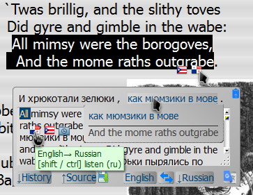
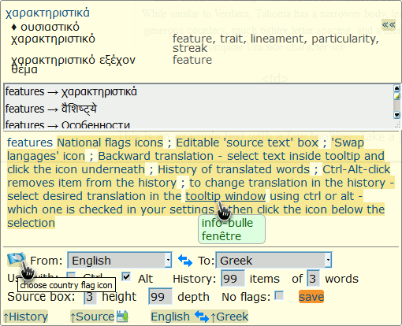

|  | ***translate.google tooltip*** | **[[`source`]](../src/translate.google_tooltip.user.js)** **[[`Install`]](/../../raw/master/src/translate.google_tooltip.user.js)** |
| :----: | :---- | ---------------------- |
##### *Script summary:*  Translates selected text into a ‘tooltip’ via Google translate 

Select word or phrase with <ins><strong><em>Alt</em></strong></ins> key pressed - then hover over an icon below the selection. 
Almost instantly you will see a tooltip with the translation. 

=====

 

***Please look more closely at the picture below:*** 

 

Script uses <a href="http://www.senojflags.com">Country flag</a> images from <a href="http://www.senojflags.com">Flags of all Countries</a>

 

* 3.7.2 2015-04-20 `*` TTS: <em>`alt`-select</em> text inside tooltip and <em>`[shift/ctrl]`-click</em> language icon below.    [tts tips](./translate_tts_tips.md) 
* 3.6.1 2015-04-17 `+` selectable background color

<small>This is a distant descendant of lazyttrick's Google Translator Tooltip</small>
 
----
