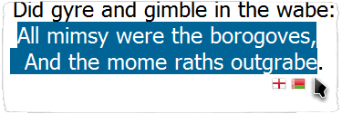
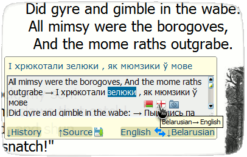

|  | ***translate.google tooltip*** | **[[`source`]](../src/translate.google_tooltip.user.js)** **[[`Install`]](/../../raw/master/src/translate.google_tooltip.user.js)** |
| :----: | :---- | ---------------------- |
##### **Script summary:**  Translates selected text into a ‘tooltip’ via Google translate 

Select word or phrase with **Alt** key pressed - then hover over an icon below the selection. 
Almost instantly you will see a tooltip with the translation. 

=====

 
 
***Please look more closely at the picture below:*** 

=====

 This is a distant descendant of lazyttrick's Google Translator Tooltip

----
